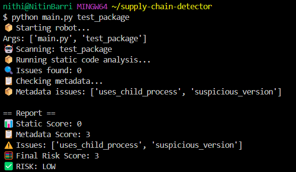

✅ What You Accomplished on Day 4
Skill	What You Did
🕵️‍♂️ Metadata Analysis	You checked the package.json for red flags
📂 Folder Scanning	You gave your bot the path to investigate
🧠 Logic Writing	You taught your bot how to score risk based on metadata
🧪 Testing	You confirmed it's working with a suspicious test case

🔍 What the Robot Found
uses_child_process: Often used to run shell commands — a security red flag ⚠️

suspicious_version: Jumped to version 5.0.0, which looks weird for a small package

🎯 Final Risk Score: 3 (still LOW, but concerning)

