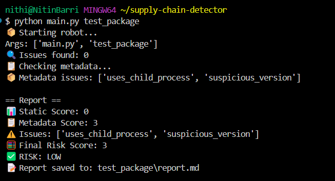

🔧 What You Built:
A new Python module: write_report.py

A Markdown-formatted report writer

File saved as: report.md inside the scanned folder

🧠 What It Does:
Combines results from static + metadata analysis

Formats them into a readable Markdown report

Includes:

Date of scan

Static and metadata scores

Detected issues

Final risk evaluation (low / high)

🧪 What You Tested:
Ran the scanner on test_package

Verified report is written as:
test_package/report.md

Readable, timestamped, and includes clear summary

